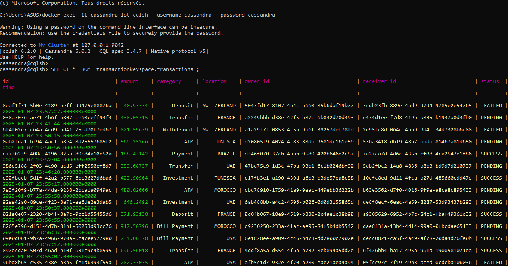
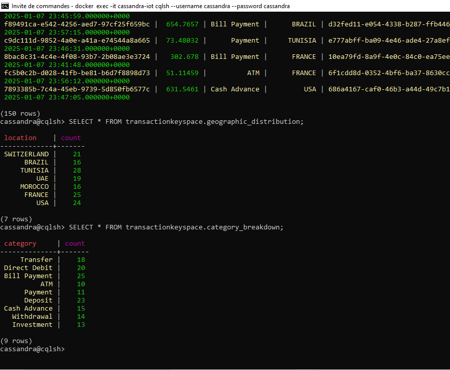
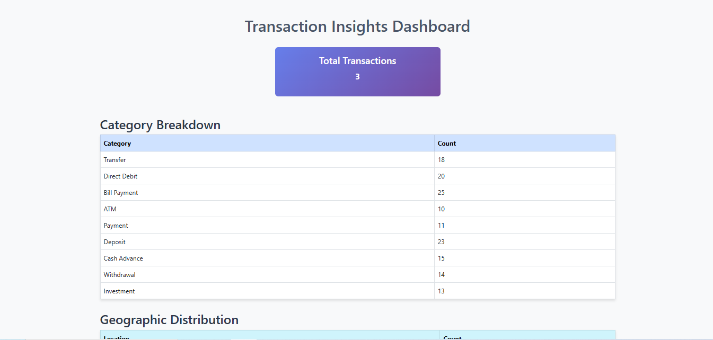
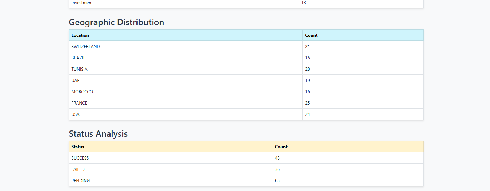
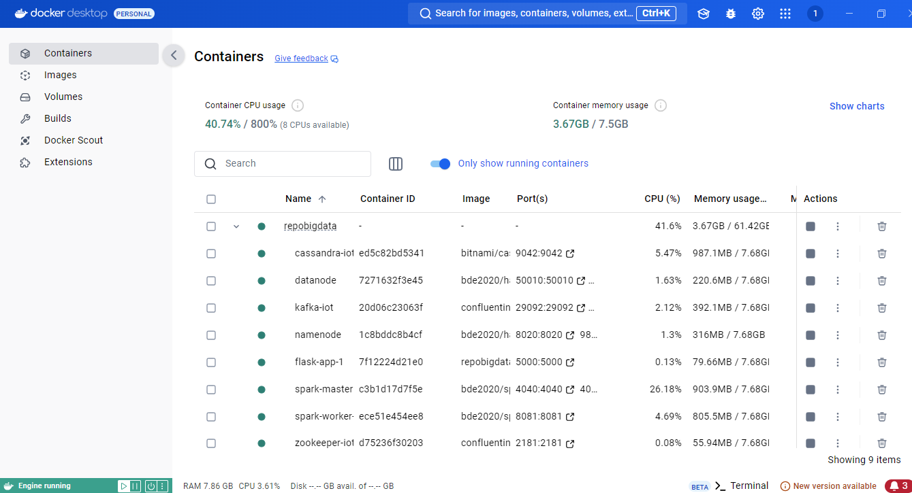

# Transaction Processing System

This project is a containerized application for simulating, processing, and analyzing transactions in real-time and batch modes. It leverages Apache Kafka, Apache Spark, Cassandra, and HDFS to handle large-scale data streams and provides insightful analytics via a dashboard.

## Features

- **Real-Time Processing**: 
  - Kafka producer generates transaction data streams.
  - Spark Streaming processes transactions in real-time and stores them in Cassandra and HDFS.
  
- **Batch Processing**:
  - Spark processes data stored in HDFS every minute to extract insights such as category breakdowns, geographic distribution, and transaction status analysis.
  - Results are stored in Cassandra for further use.

- **Dashboard**:
  - A visual interface displays insights derived from transaction data for monitoring and decision-making.

## Architecture

1. **Kafka Producer**: Simulates transaction streams.
2. **Kafka Processor**: Consumes the streams and distributes them to:
   - Cassandra for real-time queryable storage.
   - HDFS for batch processing.
3. **Spark Batch Processor**: Performs analytics on HDFS data in 1-minute time windows and updates Cassandra with insights.
4. **Dashboard**: Displays insights such as total transactions, category breakdowns, and geographic distribution.

## Technology Stack

- **Apache Kafka**: Stream processing.
- **Apache Spark**: Real-time and batch data processing.
- **Cassandra**: Real-time data storage and querying.
- **HDFS**: Distributed storage for batch processing.
- **Docker**: Containerized deployment.
- **Java**: Core application logic.

## Setup and Deployment

### Prerequisites

Ensure the following tools are installed on your system:
- Docker and Docker Compose
- Java 8 or later
- Maven

## Screenshots

### Kafka Producer Simulation
This image displays the simulation of transactions being sent via Kafka.

### Transactions in Cassandra Database
This screenshot shows the transactions registered in the Cassandra database.

### Insights from Cassandra Database
Here are the insights extracted from the Cassandra database.

### Application Dashboard
#### Part 1
Displays the first section of the dashboard.

#### Part 2
Shows the rest of the dashboard.

### Containers Overview
This image highlights the Docker containers required for the application.

---

## Installation and Setup
Provide steps for setting up the project locally or on a server.

---
